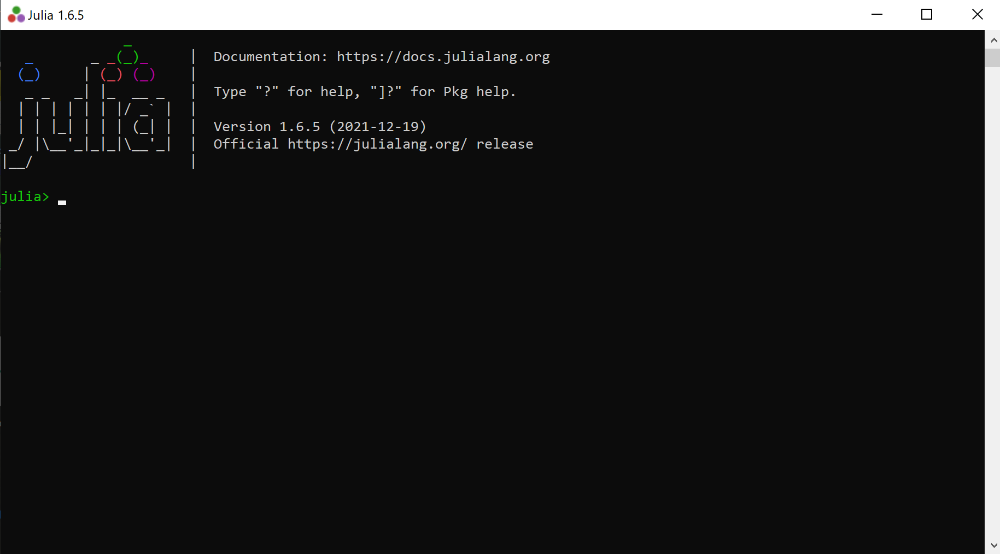
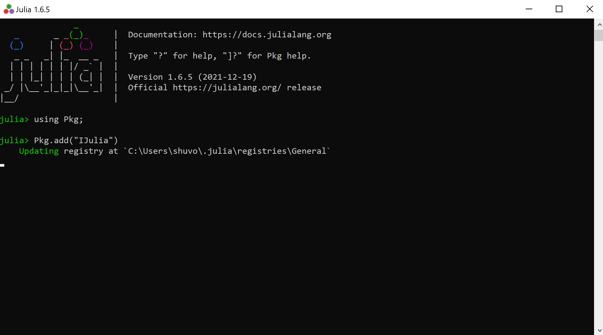
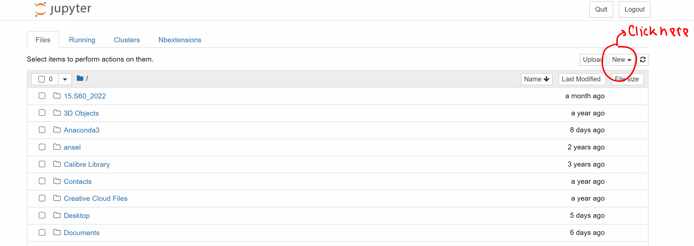
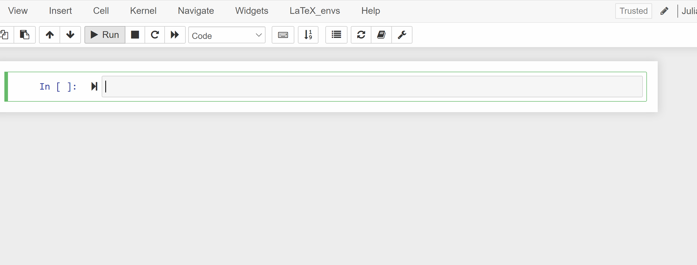

Please follow the instructions below to have a working `Julia` environment for this course this course. 

### Install Julia

* Please install Julia from https://julialang.org/downloads/, either the current stable release (version 1.7.1) or the long-term support (LTS) release: (version 1.6.5) .

* Once you have installed it, you can start by navigating to a terminal and typing "julia". You should see something like this (this is called the `Julia REPL`)



### Install a few Julia packages

#### Install IJulia

We will run Julia within the Jupyter notebook system. The package `IJulia` allows us to do that. Run the following commands in `Julia REPL`:

```julia 
import Pkg
Pkg.add("IJulia")
```



#### Install JuMP

Install `JuMP`, the modeling language for solving optimization problems, by running the following in the `Julia REPL`:

```julia 
import Pkg
Pkg.add("JuMP")
```

#### Install Ipopt

Ipopt is a solver for nonlinear optimization problems. To install it, run the following commands from the `Julia REPL`:

```julia 
import Pkg
Pkg.add("Ipopt")
```

#### Install Gurobi

Gurobi is a commercial solver to solve integer optimization problem with free academic licenses. Please follow these steps to get the software onto your computer.

* Go to [Gurobi's website](https://www.gurobi.com/) and sign up for a free account.
* The downloads page is [here](https://www.gurobi.com/downloads/gurobi-optimizer-eula/). Accept the license agreement and download the most recent version of the Gurobi optimizer (v9.5.0). Follow the installation instructions as prompted.
* After you have downloaded the optimizer software, you must obtain an Academic license.  Navigate [here](https://www.gurobi.com/downloads/end-user-license-agreement-academic/) and accept the conditions. Scroll to the bottom of the page and you should see something like this:
```
grbgetkey string-of-numbers-for-your-license
```
Copy the command for your case and paste it into a terminal (not a Julia REPL). Follow the default installation instructions as prompted. Now your computer is allowed to use Gurobi.
*  Before adding Gurobi to our Julia environment, we must point tell Julia about the Gurobi Optimizer's installation folder. Open a `Julia REPL` and type the following. If you are on a Mac:
```
ENV["GUROBI_HOME"] = "/Library/gurobi950/mac64/" # location may differ
```
Windows:
```
ENV["GUROBI_HOME"] = "C:\\Program Files\\gurobi950\\win64\\" # location may differ
```
Linux/Unix:
```
ENV["GUROBI_HOME"] = "/opt/gurobi950/linux64/" # location may differ
```
Now, regardless of operating system, run the following commands within the `Julia REPL`:
```
using Pkg
Pkg.add("Gurobi")
Pkg.build("Gurobi")
```
#### Run a test optimization problem to see if everything is working

Start a Jupyter notebook by running the following commands in the Julia REPL:

```julia 
using IJulia
notebook()
```

which will launch the IJulia notebook in your browser. The first time you run `notebook()`, it will prompt you for whether it should install Jupyter. Hit enter to have it use the [Conda.jl](https://github.com/Luthaf/Conda.jl) package to install a minimal Python+Jupyter distribution (via [Miniconda](http://conda.pydata.org/docs/install/quick.html)) that is private to Julia (not in your `PATH`). 

You will see something like the following in your browser:



Start a new Julia notebook by clicking new >> julia 1.x.x, which will open a tab looking something like this:



Okay, now copy and paste the following code in the notebook and press SHIFT+ENTER to see if everything is working well:

 ```julia 
 using JuMP, Ipopt, Gurobi
 model = Model(Gurobi.Optimizer)
 @variable(model, x >= 0)
 @variable(model, 0 <= y <= 3)
 @objective(model, Min, 12x + 20y)
 @constraint(model, c1, 6x + 8y >= 100)
 @constraint(model, c2, 7x + 12y >= 120)
 print(model)
 set_silent(model)
 optimize!(model)
 @show termination_status(model)
 @show primal_status(model)
 @show dual_status(model)
 @show objective_value(model)
 @show value(x)
 @show value(y)
 @show shadow_price(c1)
 @show shadow_price(c2)
 ```

If everything is working well, the last few lines of the output looks like:

```julia 
termination_status(model) = MathOptInterface.OPTIMAL
primal_status(model) = MathOptInterface.FEASIBLE_POINT
dual_status(model) = MathOptInterface.FEASIBLE_POINT
objective_value(model) = 205.0
value(x) = 15.0
value(y) = 1.25
shadow_price(c1) = -0.25
shadow_price(c2) = -1.5
```


